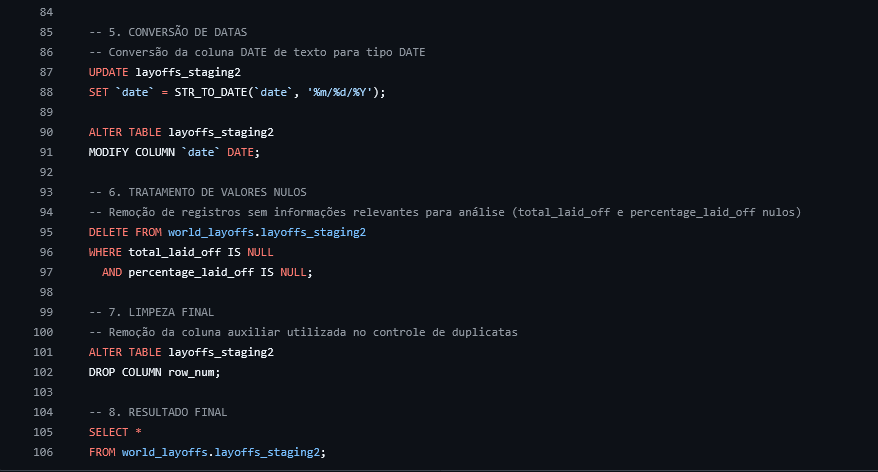

# Limpeza de Dados em SQL (Demissões 2020 - 2023)

Este projeto tem como objetivo realizar a limpeza, padronização e preparação de dados utilizando MySQL, a partir do dataset Layoffs 2022, disponível no Kaggle.
O foco do projeto foi aplicar boas práticas comuns em rotinas de Análise de Dados, BI e Engenharia de Dados.

---

## Objetivos do Projeto:

Identificar e remover duplicatas reais, Padronizar dados 
Tratar valores nulos, Converter tipos de dados
Preparar os dados para Análise Exploratória (EDA)

## Dataset:
Layoffs 2022 (Kaggle), https://www.kaggle.com/datasets/swaptr/layoffs-2022

O dataset contém informações sobre demissões em empresas de tecnologia ao redor do mundo, incluindo: Empresa Localização, Indústria, Total de demissões, Percentual de funcionários demitidos, Data do evento, Estágio da empresa, País, Fundos captados.

Ferramentas: MySQL (WorkBench), SQL 

## Etapas Realizadas: 
### 1 Inspeção Inicial
Análise preliminar da estrutura e dos dados brutos para compreensão do dataset.

### 2 Criação da Tabela de Staging
Criação de uma tabela intermediária para preservar os dados originais e permitir transformações seguras.

### 3 Remoção de Duplicatas
Identificação de duplicatas reais utilizando ROW_NUMBER()

### Criação de uma segunda tabela de staging
Remoção segura de registros duplicados

### 4 Padronização dos Dados
Conversão de valores vazios para NULL
Preenchimento de valores ausentes com base em registros semelhantes

### 5 Padronização de categorias (ex: Crypto)
Correção de inconsistências em nomes de países

### 6 Conversão de Tipos de Dados
Conversão da coluna de datas de texto para o tipo DATE

### 7 Tratamento de Valores Nulos
Remoção de registros sem informações relevantes para análise

### 8 Limpeza Final
Remoção de colunas auxiliares

Dataset final pronto para análise exploratória
